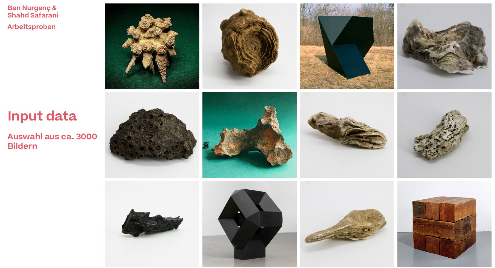
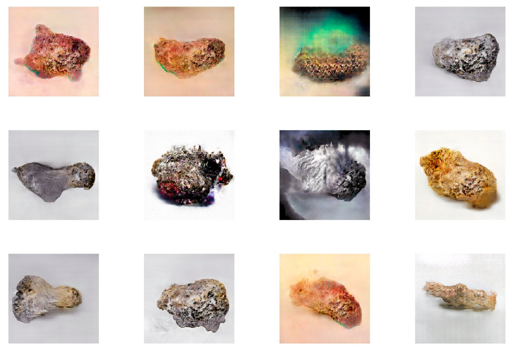

# Artistic GAN with TensorFlow and Keras
A novel artistic GAN that generates alien interestingly-looking objects as a result of the input dataset we've created to train our GAN on and bias the generator to create such fascinating novel mixed colors as well.    

# Requirement
To run the code, you need
- [keras](https://keras.io/)
- [TensorFlow](https://www.tensorflow.org/)

# WeirdGAN components 
### **Dataset**: 
The dataset is a collection of weirdly-looking alien-like objects including space rocks from different point of views, abstract artworks etc. The dataset was fully prepared by [Ben Nurgenc](https://github.com/bnurgenc), an artist that initiated this project's idea. 

### **Models**:
- **64x64 GAN**: This model uses a GAN model for generating images of size 64x64. 
- **256x256 GAN**: For generating images of size 256x256. 
 
## Training
To train the network, run ```python <model_version>_version/training.py```.

To load the model and create test images in inference phase, see the ```/256x256_scaled_version/test_notebook.ipynb``` notebook.

## Results
Please refer to the project samples PDF file under ```docs/``` for more insight into our dataset and training observations.

### Dataset samples:
<div align=center></div>


### Generated samples:

<div align=center></div>

## Acknowledgement
Our project relied highly on the following repo:
- https://github.com/javiermzll/GAN-Dog-Generator

# Authors
[Shahd Safarani](https://github.com/Shahdsaf) and [Ben Nurgenc](https://github.com/bnurgenc)
